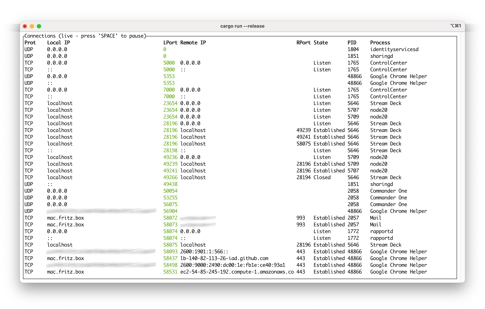
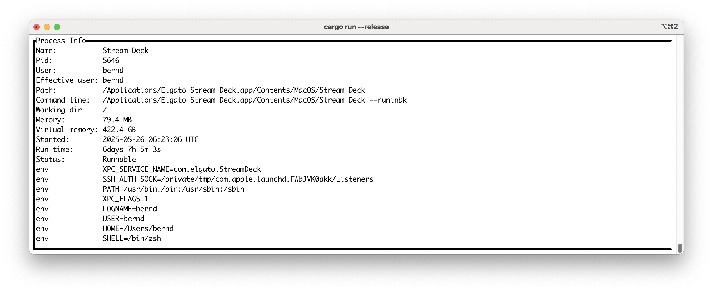

# netview

Show network connections on your local computer. This application was inspired by Mark Russinovich's [tcpview].

## Show active network connections

| Key   | Description  |
| :-:   | :-           |
| 1-8   | Sort columns |
| p     | Toggle protocol (TCP/UDP) filter |
| d     | Toggle (DNS) name resolution |
| i     | Toggle IP version filter |
| h     | Show help (not implemented, yet) |
| ↑ ↓   | Select connection (scrolls table) |
| ENTER | Show process info |
| q, Ctrl-c,ESC | Quit |

## Show process info

## Run

- [Install Rust](https://www.rust-lang.org/tools/install)
- `git clone` this repo
- cargo run --release

This [Ratatui] based application was generated by the [event driven async template].

[Ratatui]: https://ratatui.rs
[event driven async template]: https://github.com/ratatui/templates/tree/main/event-driven-async
[tcpview]: https://learn.microsoft.com/en-us/sysinternals/downloads/tcpview

## License

Copyright (c) Bernd Krietenstein <bernd.krietenstein@gmx.de>

This project is licensed under the MIT license ([LICENSE] or <http://opensource.org/licenses/MIT>)

[LICENSE]: ./LICENSE
